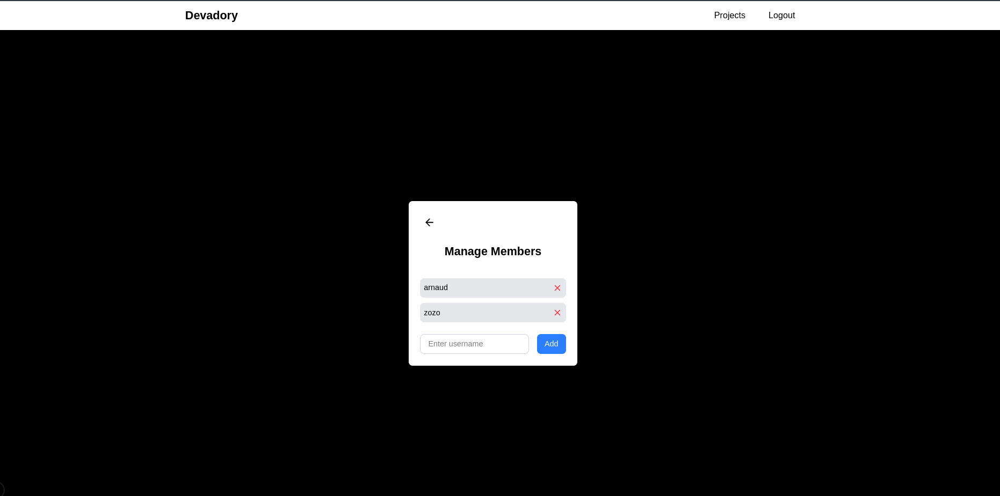

This is a [Next.js](https://nextjs.org) project bootstrapped with [`create-next-app`](https://nextjs.org/docs/pages/api-reference/create-next-app).

## Getting Started


First, install dependencies:

```bash
npm i
```
Secondly, fill the env variable with your parse server in the env.example

And last run the development server:

```bash
npm run dev
# or
yarn dev
# or
pnpm dev
# or
bun dev
```

Open [http://localhost:3000](http://localhost:3000) with your browser to see the result.

## Features added

Mise à jour de la classe Project
Ajouter: teamMembers (Relation vers User)

Gestion des membres d'équipe
Ajout de membres à un projet (via email ou nom d'utilisateur)
Liste des membres d'un projet
Suppression d'un membre d'un projet

Amélioration de l'interface utilisateur
Ajouter des états de chargement et la gestion des erreurs
Optimiser la navigation entre les différentes pages
Routes supplémentaires
/projects/[id]/members - Gestion des membres d'un projet

