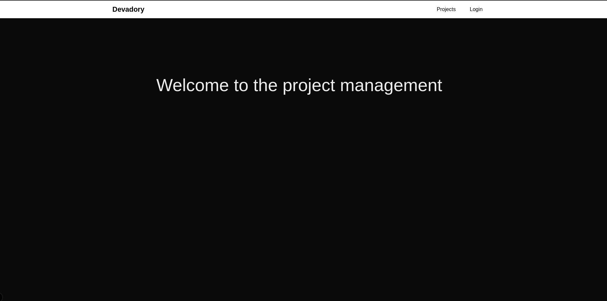

This is a [Next.js](https://nextjs.org) project bootstrapped with [`create-next-app`](https://nextjs.org/docs/pages/api-reference/create-next-app).

## Getting Started


First, install dependencies:

```bash
npm i
```
Secondly, fill the env variable with your parse server in the env.example

And last run the development server:

```bash
npm run dev
# or
yarn dev
# or
pnpm dev
# or
bun dev
```

Open [http://localhost:3000](http://localhost:3000) with your browser to see the result.

## Features
Fonctionnalités d'authentification  
Page d'inscription  
Page de connexion  
Déconnexion  

Gestion des projets (CRUD)  
Liste des projets (pour l'utilisateur connecté)  
Création d'un nouveau projet  
Page de détail d'un projet avec ses informations  
Modification d'un projet  
Suppression d'un projet  
Routes à implémenter  

/ - Page d'accueil/dashboard des projets  
/login - Connexion  
/register - Inscription  
/projects - Liste des projets  
/projects/new - Création d'un projet  
/projects/[id] - Détails d'un projet  
/projects/[id]/edit - Modification d'un projet  


open image.png if it doesnt display  
